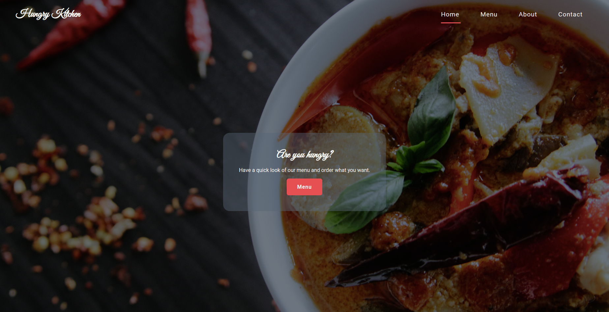

# Restaurant page

## Table of contents

- [About](#about)
- [Features](#features)
- [Live demo](#live-demo)
- [Built with](#built-with)
- [Getting started](#getting-started)
  * [Installation instructions](#installation-instructions)
- [Authors](#authors)
- [Contributing](#-contributing)
- [Show your support](#show-your-support)
- [Acknowledgements](#acknowledgments)
- [License](#-license)

---

## About

This project is a restaurant page website to display the list of menus. The screenshot of the homepage of the project is as below.

## Features

Users can view the site and look for the available menu's list and see the about and contact section of the website.

## Live Demo

This project is hosted on netlify.

[Live demo link](https://hungry-kitchen.netlify.com/)
## Built With

- HTML
- CSS
- JavaScript

## Getting Started

### Installation instructions

Follow along the steps below to get a copy at your local machine.

- Navigate to the directory where you want this project to clone and then clone it `git clone https://github.com/dipbazz/restaurant_page.git`
- Navigate to the `restaurant_page` directory
- install the npm package with `npm install`
- Open the `dist/index.html` file in the browser of your choice.

## Authors

👤 **Dipesh Bajgain**

- GitHub: [@dipbazz](https://github.com/dipbazz)
- Twitter: [@dipbazz](https://twitter.com/dipbazz)
- LinkedIn: [Dipesh Bajgain](https://www.linkedin.com/in/dipbazz/)

## 🤝 Contributing

Contributions, issues, and feature requests are welcome!

## Show your support

Give a ⭐️ if you like this project!

## Acknowledgments

- color palate used for this project is from [flatuicolors](https://flatuicolors.com/palette/ca)

- Background image by <a href="https://unsplash.com/@grimnoire">emy</a> on <a href="https://unsplash.com/s/photos/food">Unsplash</a>

- images used in menu's list [Burger](https://www.freepngimg.com/png/10726-burger-png-image), [Salad](https://www.freepngimg.com/png/16870-salad-png-picture), [pizza](https://www.freepngimg.com/png/6490-pizza-png-image), [Hot Dog](https://www.freepngimg.com/png/12983-hot-dog-png-clipart)

## 📝 License

This project is [MIT](./LICENSE) licensed.
